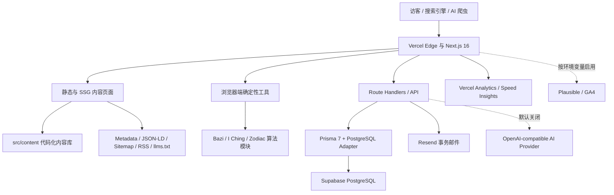
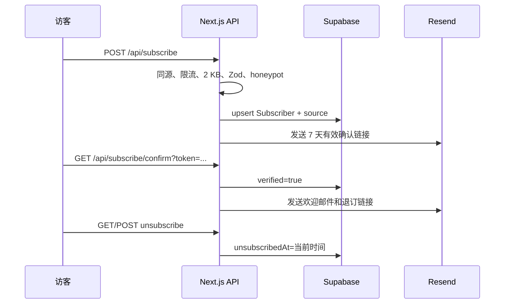

# mingliatlas 当前架构与交付记录

> 快照日期：2026-07-13（Asia/Shanghai）
>
> 生产域名：<https://mingliatlas.com>
>
> 代码分支：`main`
>
> 本文用途：记录本轮全部主要改动、当前真实架构、索引策略、生产状态、验收结果和后续维护方法。

## 1. 当前结论

本轮优化已经完成代码提交、本地验收、生产部署和线上复核。网站当前不是一个依赖 AI 才能工作的应用，而是一个以静态知识内容和浏览器端确定性工具为核心、以 Supabase/Prisma 保存订阅及联系表单、以 Resend 处理事务邮件的 Next.js 应用。

当前最重要的策略变化是：保留 243 个可访问发布路由，但只允许 36 个达到质量门槛的 URL 进入搜索索引、XML Sitemap、RSS 和 `llms-full.txt`。其余知识页继续可访问和传递内链权重，统一输出 `noindex, follow`，待内容升级后再进入白名单。

生产部署状态：

| 项目         | 当前值                                                    |
| ------------ | --------------------------------------------------------- |
| 主域名       | `https://mingliatlas.com`                                 |
| WWW 域名     | `https://www.mingliatlas.com`                             |
| Vercel 项目  | `mingliatlascom/mingliatlas`                              |
| 部署 ID      | `dpl_4738GJBzHexBUkESyc9CMQTE2DCF`                        |
| 固定部署 URL | `https://mingliatlas-7obbc5092-mingliatlascom.vercel.app` |
| 部署状态     | `Ready`                                                   |
| 构建地区     | Vercel `iad1`                                             |
| 生产构建     | 260 个页面生成成功                                        |
| 当前代码基线 | `636c0d0187adbf31c96e13188aa4ed0e9e605f92`                |

## 2. 总体架构



架构原则：

1. 内容和核心工具不能依赖外部 AI 服务才能工作。
2. 知识页尽量静态生成，提升稳定性、抓取效率和首屏性能。
3. 数据库只承担需要持久化的用户提交、订阅和未来账户数据。
4. GEO、SEO 和传统站内发现共用一份页面注册表和索引白名单，避免多套清单漂移。
5. 所有外部服务失败都应降级，不应破坏内容阅读或确定性计算结果。

## 3. 技术栈

| 层级      | 技术                                   | 用途                                       |
| --------- | -------------------------------------- | ------------------------------------------ |
| Web 框架  | Next.js 16.2.6 App Router              | 页面、SSG、Route Handlers、Metadata Routes |
| UI        | React 19.2.4、Tailwind CSS 4.3         | 组件与响应式界面                           |
| 语言      | TypeScript 5，严格模式                 | 应用、脚本和测试                           |
| 图标      | Lucide React                           | 工具及界面图标                             |
| 表单      | Zod、React Hook Form                   | 输入校验和客户端表单                       |
| 日期/历法 | `lunar-typescript`、自有 calendar 模块 | 农历、干支、节气和四柱计算                 |
| 数据库    | Supabase PostgreSQL                    | 订阅、联系消息及预留业务数据               |
| ORM       | Prisma 7.8 + `@prisma/adapter-pg`      | 数据模型、迁移和 PostgreSQL 连接           |
| 邮件      | Resend HTTP API                        | 确认邮件、欢迎邮件、联系通知               |
| 分析      | Vercel Analytics、Speed Insights       | 生产访问与性能                             |
| 可选分析  | Plausible、GA4                         | 自定义事件和流量归因                       |
| 测试      | Vitest 4.1.7                           | 算法、SEO、表单和安全测试                  |
| 托管      | Vercel                                 | 构建、Serverless Functions、域名           |
| 包管理    | pnpm 11.2.2                            | 锁定依赖与脚本执行                         |

## 4. 目录和模块边界

```text
src/
├── app/                     Next.js 页面、布局、Metadata Routes 和 API
│   ├── api/                 AI、联系表单、分享卡、订阅生命周期
│   ├── bazi/                Bazi 动态 SSG 路由
│   ├── blog/                博客索引与文章路由
│   ├── chinese-zodiac/      生肖动态 SSG 路由
│   ├── feng-shui/           风水动态 SSG 路由
│   ├── i-ching/             易经动态 SSG 路由
│   ├── learn/               学习路径动态 SSG 路由
│   ├── tools/               三个公开工具
│   └── ziwei/               紫微斗数动态 SSG 路由
├── components/
│   ├── analytics/           埋点、表单和滚动深度追踪
│   ├── layout/              Header、Footer、MobileNav
│   ├── seo/                 Organization/WebSite Schema
│   ├── shared/              FAQ、Direct Answer、引用、CTA、相关内容
│   ├── subscriptions/       通用 NewsletterSignup
│   ├── templates/           KnowledgePage、StaticPage
│   └── tools/               Bazi、I Ching、生肖兼容工具 UI
├── content/                 代码化知识内容与文章数据
│   ├── bazi/
│   ├── blog/
│   ├── feng-shui/
│   ├── i-ching/
│   ├── learn/
│   ├── zodiac/
│   └── ziwei/
├── lib/
│   ├── ai/                  AI prompt 构造
│   ├── analytics/           Plausible/GA4 事件分发
│   ├── bazi/                四柱与派生结果算法
│   ├── calendar/            节气、农历、干支、星历辅助
│   ├── content/             页面注册、索引白名单、引用解析、术语图谱
│   ├── email/               Resend 适配层
│   ├── forms/               Zod 提交模型
│   ├── i-ching/             64 卦、投币和变爻算法
│   ├── security/            同源校验、限流、请求体限制
│   ├── seo/                 Metadata、JSON-LD、LLM 发现文件
│   ├── subscriptions/       HMAC 确认/退订令牌
│   └── zodiac/              六合、三合、六冲兼容算法
├── generated/prisma/        Prisma 生成代码，不手工修改
└── styles/                  全局样式

prisma/                      Schema 和数据库迁移
scripts/                     内容、链接、线上页面和运营审计脚本
__tests__/                   Vitest 测试
docs/                        运维、部署、分析和质量审计记录
```

内容当前以 `src/content/**/*.tsx` 为事实来源，不是从数据库或 CMS 动态读取。Prisma 中的 `Page` 和 `BlogPost` 模型是未来内容后台的预留结构；当前修改文章应直接修改对应内容文件。

## 5. 路由与内容规模

当前 `publishedSitePages` 注册 243 个发布路由：

| 分区           | 路由数 |
| -------------- | -----: |
| Home           |      1 |
| Blog           |     44 |
| Bazi           |     14 |
| Chinese Zodiac |     41 |
| Learn          |      6 |
| Ziwei          |     37 |
| I Ching        |     70 |
| Feng Shui      |     19 |
| Tools          |      4 |
| Company        |      2 |
| Legal          |      2 |
| Utility        |      3 |
| 合计           |    243 |

知识板块使用可选 catch-all 路由和 `generateStaticParams()` 静态生成。通用 `KnowledgePage` 模板负责：

- 面包屑、标题、直接回答和关键统计；
- 分层正文、FAQ、相关内容、CTA 和订阅入口；
- 可核验来源列表及缺失 URL 的集中解析；
- Article/DefinedTerm、FAQPage、BreadcrumbList JSON-LD；
- 教育和自我反思用途免责声明。

## 6. 当前索引白名单

唯一索引事实来源是 `src/lib/content/indexing.ts`。当前 36 个可索引 URL 如下。

基础与工具：

- `/`
- `/about`
- `/contact`
- `/tools`
- `/tools/bazi-calculator`
- `/tools/i-ching-oracle`
- `/tools/zodiac-compatibility`

博客：

- `/blog`
- `/blog/day-master-bazi-complete-guide`
- `/blog/chinese-zodiac-compatibility-chart`
- `/blog/i-ching-beginners-reading-guide`
- `/blog/ren-water-day-master`

Bazi：

- `/bazi`
- `/bazi/what-is-bazi`
- `/bazi/five-elements`
- `/bazi/heavenly-stems`
- `/bazi/earthly-branches`
- `/bazi/ten-gods`
- `/bazi/luck-pillars`

Chinese Zodiac：

- `/chinese-zodiac`
- `/chinese-zodiac/rat`
- `/chinese-zodiac/tiger`
- `/chinese-zodiac/dragon`
- `/chinese-zodiac/2026-forecast`

I Ching：

- `/i-ching`
- `/i-ching/eight-trigrams`
- `/i-ching/how-to-cast`
- `/i-ching/sixty-four-hexagrams`
- `/i-ching/hexagram-1`
- `/i-ching/hexagram-2`
- `/i-ching/hexagram-29`
- `/i-ching/hexagram-30`
- `/i-ching/hexagram-63`
- `/i-ching/hexagram-64`

其他核心入口：

- `/feng-shui`
- `/ziwei`

白名单的影响范围：

1. 知识页 Metadata 根据白名单决定 `index`，非白名单保持 `follow: true`。
2. `/sitemap.xml` 只输出白名单 URL。
3. `/rss.xml` 只输出白名单博客文章。
4. `/llms-full.txt` 只输出白名单页面。
5. `/llms.txt` 的重点页面引用会经过白名单过滤。
6. 索引策略测试保证白名单无重复、路由真实存在、机器发现文件不泄漏降级页面。

将新页面加入白名单前，至少应满足：独立搜索意图、足够正文深度、非模板化回答、独立 FAQ、明确实体关系、可核验来源、完整内链和正确 canonical。

## 7. SEO 与 GEO 架构

### 7.1 搜索发现

- 每页输出 canonical、标题、描述、Open Graph 和 robots 指令。
- 首页和根布局输出 Organization、WebSite Schema。
- 知识页输出 Article/DefinedTerm、FAQPage、BreadcrumbList Schema。
- 工具页输出 WebApplication、HowTo 或 ItemList Schema。
- `robots.txt` 禁止 `/api/` 和 `/admin/`，允许普通搜索及 GPTBot、OAI-SearchBot、ChatGPT-User、PerplexityBot、ClaudeBot、Claude-SearchBot、anthropic-ai、CCBot、Google-Extended。
- `sitemap.xml`、RSS、`llms.txt`、`llms-full.txt` 都由代码动态生成，避免人工清单漂移。

### 7.2 GEO 内容结构

- 页面首屏提供可直接引用的 Direct Answer。
- 中英文实体名、拼音、DefinedTerm 和 `about`/`mentions` 关系帮助实体消歧。
- Sources 区分古典文本、现代书籍和编辑解释。
- `llms.txt` 提供站点定位、权威回答、核心实体和引用政策。
- `llms-full.txt` 提供经过质量批准的完整页面索引。
- FAQ、段落标题和正文围绕真实问题组织，降低仅为关键词堆叠的风险。

### 7.3 永久重定向

- `/bazi/free-calculator` -> `/tools/bazi-calculator`
- `/blog/what-is-bazi` -> `/bazi/what-is-bazi`
- `/chinese-zodiac/compatibility` -> `/blog/chinese-zodiac-compatibility-chart`
- `www.mingliatlas.com/:path*` -> `mingliatlas.com/:path*`

以上均使用永久重定向，线上验收为 HTTP 308。

## 8. 三个核心工具

### 8.1 Bazi Calculator

输入出生日期和时间后，在浏览器端计算年、月、日、时四柱，并派生：

- Day Master；
- 天干、地支和藏干；
- Ten Gods 关系；
- 五行计数、比例、强弱和缺失提示；
- 时区/日期边界提示；
- 可分享查询参数和分享卡数据。

该工具目前生成本命四柱，不计算 Da Yun（大运）起运和十年运柱。确定性结果不依赖 AI 接口。

### 8.2 I Ching Oracle

- 使用传统三枚硬币、六爻自下而上的结构；
- 支持老阴、少阳、少阴、老阳和变爻；
- 映射完整 64 卦；
- 有变爻时生成之卦；
- 输出用于反思的摘要，不把结果描述为固定预测。

### 8.3 Zodiac Compatibility

- 覆盖 12 生肖及地支、五行、阴阳属性；
- 计算六合、三合、六冲和无主要关系的中性组合；
- 输出分数、关系名称、优势、注意事项和讨论提示；
- 明确提示生肖年柱不能替代完整 Bazi 合盘。

## 9. AI 接口现状

`POST /api/ai/interpret` 是可选增强层，支持 `bazi`、`i-ching`、`zodiac-compatibility` 三类结构化输入和 OpenAI-compatible `/v1/chat/completions` 提供商。

生产环境当前有意关闭 AI：

- `AI_INTERPRETATION_ENABLED` 未设为 `true`；
- 接口返回 HTTP 503 和 `Retry-After`；
- 三个工具的确定性结果、内容页面、订阅和联系表单不受影响；
- 不开启可以避免不稳定解释、额外成本和无来源回答影响站点可信度。

未来开启前需要同时配置 provider URL、API key、模型，补充来源约束、成本上限、监控和回归验收。任何 provider key 都不得进入 Git。

## 10. 数据库和邮件生命周期

### 10.1 Prisma 数据模型

| 模型             | 当前用途                                     |
| ---------------- | -------------------------------------------- |
| `Subscriber`     | 邮箱、验证状态、来源偏好、订阅/退订时间      |
| `ContactMessage` | 联系表单消息和处理状态                       |
| `Page`           | 预留数据库内容模型，当前页面未从这里读取     |
| `BlogPost`       | 预留数据库博客模型，当前文章未从这里读取     |
| `User`           | 预留账户模型，当前没有公开登录流程           |
| `Chart`          | 预留用户保存命盘，当前没有公开保存流程       |
| `ToolUsage`      | 预留匿名工具使用记录，当前主要追踪走分析事件 |

数据库连接由 `DATABASE_URL` 注入，Prisma 使用 PostgreSQL adapter；Supabase 地址会自动追加强制 SSL 参数。数据库迁移位于 `prisma/migrations/`，生产部署前应执行 `pnpm db:migrate` 或受控的 `prisma migrate deploy`。

### 10.2 订阅流程



- 确认和退订链接使用 HMAC-SHA256 签名；
- token 区分 `confirm` 与 `unsubscribe` 用途；
- token 有效期为 7 天；
- 签名比较使用 timing-safe comparison；
- 重复订阅会清除 `unsubscribedAt`；
- 邮件发送失败不会删除已保存的数据库记录。

### 10.3 联系表单

- 同源检查；
- 10 分钟最多 5 次；
- 请求体上限 12 KB；
- 姓名 2-80 字、邮箱标准化、消息 10-5000 字；
- honeypot 命中时返回中性成功页，不写数据库；
- 正常提交写入 `ContactMessage`；
- 配置通知邮箱后，通过 Resend 向编辑邮箱发送 HTML 转义后的通知。

### 10.4 当前邮件验收边界

生产环境已经配置以下变量名称：`RESEND_API_KEY`、`EMAIL_FROM`、`CONTACT_NOTIFICATION_EMAIL`、`SUBSCRIPTION_TOKEN_SECRET`。本轮只验证了配置存在、接口校验和错误流，没有发送真实邮件，因此最终邮箱送达、发件域名信誉、垃圾邮件归类仍需通过受控测试确认。

## 11. 安全和隐私

全站响应头包括：

- Content-Security-Policy；
- Cross-Origin-Opener-Policy；
- Permissions-Policy，禁用摄像头、麦克风、地理位置；
- Referrer-Policy；
- X-Content-Type-Options；
- X-Frame-Options `DENY`。

公开写接口统一采用同源检查、请求体字节上限、Zod 校验、honeypot 和按客户端哈希标识的限流。日志不应输出表单正文、邮箱列表、API key、数据库连接串或签名链接。

当前限流器使用进程内 `Map`，适合早期低流量保护，但在 Vercel 多实例环境中不是全局限流。流量明显增长后，应优先迁移到 Upstash Redis、Vercel KV 或其他共享存储。

## 12. 分析与事件

生产部署自动加载 Vercel Analytics 和 Speed Insights。Plausible 与 GA4 只有在对应公开环境变量存在时才加载。

当前自定义事件：

- `calculator_started`
- `calculator_completed`
- `share_card_clicked`
- `ai_interpretation_requested`
- `subscribe_clicked`
- `subscribe_requested`
- `subscribe_confirmed`
- `related_content_clicked`
- `page_scroll_75`

订阅表单记录 `footer`、`subscribe_page`、`knowledge_page`、`bazi_chart` 或 `unknown` 来源。数据库运营报告只输出汇总数量、状态和时间，不输出邮箱或消息正文。

## 13. 本轮主要改动记录

以下八个提交构成本次架构和增长优化的主要交付链：

| 提交      | 日期       | 主要内容                                                 |
| --------- | ---------- | -------------------------------------------------------- |
| `bffec67` | 2026-06-21 | 重构高意图首页和 Zodiac 路径，补强 Dragon 等机会页面     |
| `62d88b2` | 2026-07-05 | 周度 SEO 内容、Open Graph、工具追踪和页面体验优化        |
| `6e284b0` | 2026-07-12 | 合并生产 SEO 改动、补强高价值内容、结构化数据和重定向    |
| `cfe901d` | 2026-07-13 | 生产安全加固、表单持久化、请求限制、数据库迁移和增长闭环 |
| `3ac2552` | 2026-07-13 | 深化 Bazi 计算结果、分享数据、订阅/退订流程和运营报告    |
| `5396f7c` | 2026-07-13 | 接入 Resend，增加确认、欢迎、退订和联系通知邮件          |
| `c9638ce` | 2026-07-13 | 建立 36 URL 索引白名单，大幅补强核心内容与 GEO/转化组件  |
| `636c0d0` | 2026-07-13 | 修复 Zodiac 来源 URL，并增加防回归测试                   |

本轮内容质量重点：

- I Ching 核心入口约 1522 词，质量审计 92/A；
- Feng Shui 核心入口约 1503 词，92/A；
- Ziwei 核心入口约 1513 词，90/A；
- Chinese Zodiac 核心入口约 1520 词，80/B；
- Day Master 指南约 857 词，80/B；
- Zodiac Compatibility 指南约 813 词，78/B；
- I Ching 初学指南约 802 词，80/B；
- 2026 Forecast 约 1200 词，78/B；
- 白名单审计页面中 C/D 等级为 0。

全量 243 个发布页面中仍有尚未升级的模板化或薄内容，这正是没有一次性全部开放索引的原因。`docs/audit-2026-05/` 保留全量质量基线，不能把全量平均分误解为白名单质量。

## 14. 本地验收记录

2026-07-13 的完整本地验收结果：

| 检查                                                    | 结果                                  |
| ------------------------------------------------------- | ------------------------------------- |
| `pnpm test -- --run`                                    | 81/81 通过                            |
| `pnpm exec tsc --noEmit`                                | 通过                                  |
| `pnpm lint`                                             | 通过                                  |
| `pnpm build`                                            | 通过，260 个页面生成                  |
| `pnpm audit:links`                                      | 243 个发布路由、36 个索引路由，无断链 |
| `AUDIT_BASE_URL=http://localhost:3000 pnpm audit:local` | 通过                                  |
| Sitemap/RSS/LLM 白名单检查                              | 通过，无降级页面泄漏                  |
| 永久重定向                                              | 返回 308                              |
| AI 关闭态                                               | 按预期返回 503                        |
| 桌面和 390 px 移动端                                    | 无重叠、无横向溢出                    |

## 15. 线上验收记录

生产验收在 `https://mingliatlas.com` 完成：

- `AUDIT_BASE_URL=https://mingliatlas.com pnpm audit:local` 全部通过；
- 主域名返回 HTTP 200，并包含预期安全头；
- Sitemap 为 36 个质量白名单 URL；
- RSS 和 `llms-full.txt` 未包含降级页面；
- 非白名单知识页以及 Learn、Privacy、Terms、Search、Subscribe 输出 `noindex`；
- 两条内容合并重定向和旧计算器路由返回 308；
- 无效订阅和联系请求返回 303 到对应错误状态页；
- Dragon 页 Martin Palmer 来源已在真实浏览器中确认指向 Google Books；
- Bazi Calculator 输入 `2000-02-05 23:30` 后，结果更新为 Yin Water Day Master，四柱、元素比例和分享参数同步更新；
- 桌面和移动端页面视觉验收正常；
- Vercel 构建日志显示编译、TypeScript、260 页生成和部署全部完成，最终状态 `Ready`。

## 16. 环境变量清单

只记录变量名，不在文档或 Git 中保存值。

| 变量                            | 必需性              | 用途                            |
| ------------------------------- | ------------------- | ------------------------------- |
| `DATABASE_URL`                  | 数据库路由必需      | Prisma PostgreSQL 连接          |
| `NEXT_PUBLIC_SUPABASE_URL`      | Supabase 客户端需要 | Supabase 项目 URL               |
| `NEXT_PUBLIC_SUPABASE_ANON_KEY` | Supabase 客户端需要 | Supabase 匿名公钥               |
| `NEXT_PUBLIC_SITE_URL`          | 生产建议设置        | canonical、Schema、签名链接域名 |
| `RESEND_API_KEY`                | 发信必需            | Resend 认证                     |
| `EMAIL_FROM`                    | 发信必需            | 已验证发件人                    |
| `CONTACT_NOTIFICATION_EMAIL`    | 联系通知可选        | 编辑收件邮箱                    |
| `SUBSCRIPTION_TOKEN_SECRET`     | 邮件确认必需        | HMAC token 签名                 |
| `NEXT_PUBLIC_PLAUSIBLE_DOMAIN`  | 可选                | Plausible                       |
| `NEXT_PUBLIC_GA_MEASUREMENT_ID` | 可选                | GA4                             |
| `AI_PROVIDER_BASE_URL`          | AI 开启时必需       | OpenAI-compatible provider      |
| `AI_PROVIDER_API_KEY`           | AI 开启时必需       | Provider 认证                   |
| `AI_PROVIDER_MODEL`             | AI 开启时可选       | 模型名                          |
| `AI_INTERPRETATION_ENABLED`     | 默认关闭            | 必须为 `true` 才启用 AI         |

密钥轮换时应在 Vercel/Supabase/Resend 控制台操作，不要把旧值写入 Issue、提交信息、日志或本文。

## 17. 标准维护流程

### 17.1 内容升级

1. 在 `src/content/<section>/` 修改对应页面。
2. 更新页面 `dateModified`。
3. 增加独立 Direct Answer、正文、FAQ、来源和相关内链。
4. 先运行内容审计，不要立即加入索引白名单。
5. 达到质量标准后，在 `src/lib/content/indexing.ts` 加入 URL。
6. 运行 SEO、链接和完整测试，确认 Sitemap/RSS/LLM 同步变化。

### 17.2 本地发布验收

```bash
pnpm install --frozen-lockfile
pnpm test -- --run
pnpm exec tsc --noEmit
pnpm lint
pnpm build
pnpm audit:links
pnpm start
AUDIT_BASE_URL=http://localhost:3000 pnpm audit:local
```

如果 3000 端口已占用，使用其他端口启动，并把同一端口写入 `AUDIT_BASE_URL`。

### 17.3 数据库变更

```bash
pnpm exec prisma migrate dev --name <migration_name>
pnpm exec prisma generate
pnpm test -- --run
pnpm db:migrate
```

生产迁移应在受控发布步骤执行，不要让每个 Preview Deployment 自动修改生产数据库。

### 17.4 生产部署与验收

```bash
npx vercel@latest --prod
AUDIT_BASE_URL=https://mingliatlas.com pnpm audit:local
npx vercel@latest inspect <deployment-url> --logs
```

另外人工验证首页、核心内容页、三个工具、订阅/联系错误流、移动端布局和关键重定向。真实发信会产生外部行为，应使用专门测试邮箱并在获得授权后执行。

### 17.5 运营汇总

```bash
pnpm ops:report
pnpm ops:report -- 30
```

该报告只输出活跃/退订订阅数、时间窗口内新增数量、未处理联系消息数和最近状态，不输出个人内容。

## 18. 当前明确限制和下一阶段优先级

### P0：验证真实增长闭环

1. 用 GSC 按 7/28 天窗口监测 36 个白名单 URL 的曝光、点击、CTR、平均排名和索引状态。
2. 验证 Resend 发件域名、确认邮件、欢迎邮件、退订和联系通知的真实送达。
3. 确认 Plausible/GA4/Vercel Analytics 中核心事件可以形成访问 -> 工具完成 -> 订阅的漏斗。

### P1：继续提升内容，而不是扩大低质量索引

1. 根据真实曝光和查询逐页升级非白名单内容。
2. 优先处理已有曝光但 CTR 或排名不足的页面。
3. 每次只把通过质量审计的页面加入白名单，避免 Sitemap 再次膨胀。
4. 为核心实体补充更多一手/权威来源和可复核示例。

### P1：基础设施可靠性

1. 将进程内限流迁移到共享存储。
2. 增加邮件 provider 响应、退信和失败告警，但不得记录敏感正文。
3. 验证 Preview 环境变量、PR Preview 和数据库隔离。

### P2：产品能力

1. 是否开放登录、保存命盘和历史记录，需要单独产品决策；数据库模型存在，但当前没有前端流程。
2. 是否建设 CMS/admin，需要先解决编辑权限、审计日志和发布审核。
3. AI 只有在来源约束、成本、质量和监控齐备后再开启，不应作为当前增长前置条件。

## 19. 版本控制和文件保护

- 正式代码仓库：`git@github.com:xuanshaogg/mingliatlas.git`。
- 生产分支：`main`。
- 本记录创建前，远程 `main` 与本地 `636c0d0` 一致。
- 用户原有未跟踪文件 `CODEX-P0-SEO-OPTIMIZATION-20260618.md` 不属于本次提交，必须保留且不得擅自删除或提交。
- `.env.local`、API key、数据库密码、订阅签名 URL 和真实邮箱数据不得进入版本控制。

本文是 2026-07-13 的架构快照。以后若索引数量、部署 ID、环境变量、数据模型、服务开关或验收结果发生变化，应在同一变更中更新本文或建立新的日期快照。
